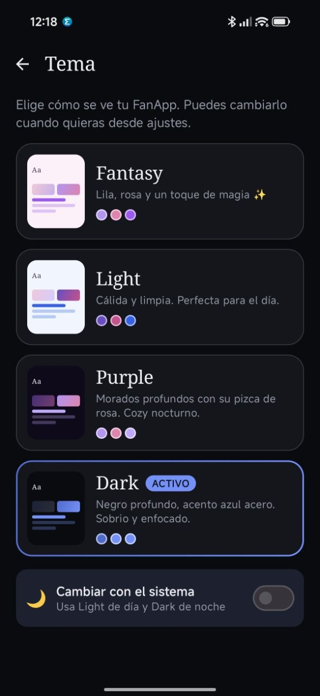
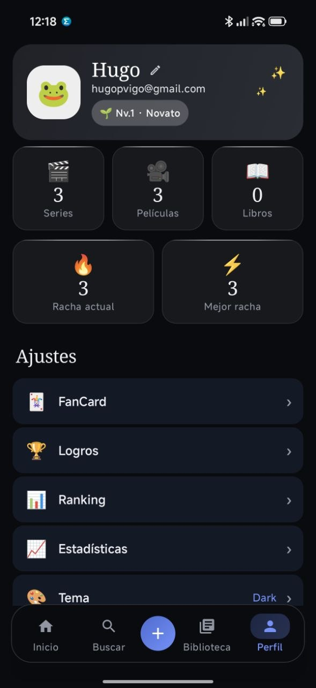
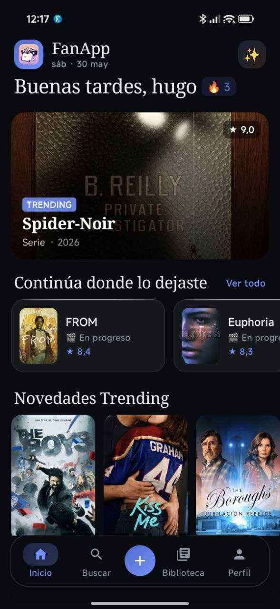
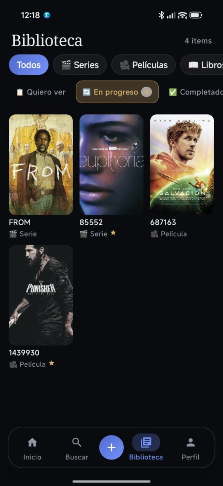

<div align="center">
  
  <br/>
  <em>Unifica lo que consumes.</em>
</div>

> **🚧 En Desarrollo** — Este proyecto está en fase activa de construcción.
> Todo lo que ves aquí puede cambiar, romperse, o evolucionar.
> Bienvenido al proceso.

---

## 🎯 ¿Qué es FanAPP MediaTracker?

Una app Android que unifica el seguimiento de **series**, **películas** y **libros** en un solo lugar.

| 🎬 Series | 🎥 Películas | 📖 Libros |
|-----------|-------------|-----------|
| Temporadas y episodios | Historial de visionado | Páginas y progreso de lectura |

Olvídate de tener 3 apps distintas. Todo tu contenido, un solo sitio.

> Inspirado en Letterboxd, Goodreads y TVTime… pero todo junto.

---

## 🧭 Pantallas

```
┌──────────────────────────────────────────────────────────────┐
│   🏠 Home   🔍 Discover   ➕ Quick Add   📚 Library   👤 Profile   │
└──────────────────────────────────────────────────────────────┘
```

| Pantalla | Qué hace |
|----------|----------|
| 🏠 **Home** | Resumen: continúa donde lo dejaste, novedades, favoritos, últimos guardados |
| 🔍 **Discover** | Busca series, películas o libros por separado + ranking de trending |
| ➕ **Quick Add** | Añade contenido a tus listas rápidamente desde los resultados de búsqueda |
| 📚 **Library** | Tus listas filtradas por estado: quiero ver, en progreso, completado, abandonado |
| 👤 **Profile** | Stats, logros, ranking, import CSV, FanCard, racha 🔥, nivel XP, tema, notificaciones, privacidad |

> 🚧 Pantallas, nombres y flujos pueden cambiar durante el desarrollo.

---

## 📱 Screenshots

<div align="center">

| | |
|:---:|:---:|
| **🏠 Home** | **🔍 Discover** |
|  |  |
| **📚 Library** | **👤 Profile** |
|  |  |

</div>

---

## ⚙️ Stack Técnico

| Componente | Tecnología |
|------------|------------|
| 🧠 Lenguaje | Kotlin |
| 🎨 UI | Jetpack Compose + Material 3 |
| 🏗️ Arquitectura | Clean Architecture + MVVM |
| 🔐 Auth | Firebase Auth (Google + Email/Password) |
| ☁️ DB Remota | Firebase Firestore |
| 💾 DB Local | Room (offline-first) |
| 🌐 APIs | TMDB (series/pelis) + Google Books |
| 🖼️ Imágenes | Coil |
| 🔌 Networking | Retrofit + OkHttp |
| 💉 DI | Hilt |
| 🧭 Navegación | Navigation Compose |
| 🌍 Idiomas | Español / English |

> 🚧 Stack puede ajustarse según necesidades que surjan durante el desarrollo.

---

## 🧱 Cómo se organiza el código

```
📦 com.mediatracker/
├── 🏗️ di/           → Hilt modules
├── 📡 data/          → APIs, Room, Firestore, repositorios
├── 🧠 domain/        → Modelos, interfaces, casos de uso
├── 🖥️ presentation/  → Screens, ViewModels, componentes
└── 🔧 core/          → Utilidades transversales
```

Regla de oro: la UI nunca habla directamente con APIs ni bases de datos.

---

## 📊 Estados de tu contenido

```
📋 Quiero ver/leer  →  🔄 En progreso  →  ✅ Completado  →  ❌ Abandonado
                        ⭐ Favorito (toggle independiente)
```

Cada serie, película o libro puede estar en un estado. Y puedes marcarlo como favorito aparte.

---

## 🗺️ Roadmap

```
📦 Fase 1 — MVP ✅
├── Auth + setup del proyecto
├── Búsqueda + detalle de contenido
├── Listas del usuario sincronizadas
├── Home + Perfil con contadores
└── Primera build funcional

🚀 Fase 2 — Engagement (en progreso)
├── ✅ Botón Add rápido (Quick Add)
├── ✅ Trackeo temporada/episodio en series
├── ✅ Valoraciones (1-5) y notas
├── ✅ Progreso de página en libros
├── ✅ Estadísticas con gráficos (Vico)
├── ✅ Rachas diarias + bonus XP
├── ✅ 12 logros con desbloqueo automático
├── 🔜 Widgets, idioma en runtime, tests, release candidate (Sprint 9)
└── 🔜 Logros expandidos, retos y niveles avanzados (Sprint 10)

🤝 Fase 3 — Social (parcial)
├── ✅ Ranking / Leaderboard (Firestore)
├── ✅ Import Letterboxd + Goodreads (CSV)
├── ✅ FanCard compartible
├── 🔜 Perfiles públicos y actividad social
└── 🔜 Recomendaciones y comparar listas
```

> 🚧 Fechas, fases y features pueden cambiar.
> El roadmap es una guía, no un contrato.

---

## 🔑 Estado actual

```
████████████████░░░░ ~80% MVP+ — Sprint 8 parcial · Sprint 9 en curso (RC)
```

| Sprint | Estado | Highlights |
|--------|--------|------------|
| Sprint 1 — Setup + Auth | ✅ | Firebase, navegación, placeholders |
| Sprint 2 — Upgrade de Versiones | ✅ | Gradle 9, Kotlin 2.3, Retrofit 3 |
| Sprint 3 — APIs + Data Layer | ✅ | TMDB, Google Books, Room, Library |
| Sprint 4 — Temas + Home + Pulido | ✅ | 4 temas, Discover, Detail |
| Sprint 5 — Bugs y Pendientes | ✅ | Notificaciones, privacidad, gamificación base |
| Sprint 6 — Diseño Visual | ✅ | Glass iOS26, hero Detail, featured Home, Open Library |
| Sprint 7 — Engagement y Social | ✅ | Google Sign-In, Quick Add, logros, ranking, import CSV, FanCard, stats completas |
| Sprint 8 — Progreso Detallado | ✅ T1–T3 | Páginas, EpisodeTracker, auto-completar; gamificación expandida → Sprint 10 |
| Sprint 9 — Estabilización y RC | 🔄 En curso | Progreso granular series/libros, widgets, idioma, FCM, tests, Play Console internal track |
| Sprint 10 — Gamificación Expandida | 📋 Planificado | Logros 45, retos, niveles avanzados, resumen semanal, widget 4x4 |

Para el detalle técnico por tarea, consulta `CHANGELOG.md`.

---

## ⚡ Quick Start (para developers)

```bash
git clone <repo>
# Abrir en Android Studio
# Poner google-services.json en app/
./gradlew assembleDebug
```

Añadir en `local.properties`:

```properties
TMDB_API_KEY=tu_key
GOOGLE_BOOKS_API_KEY=tu_key
```

---

---

<div align="center">

Hecho con ❤️ para Denisa

**Desarrollado por [Hugo Perez-Vigo](https://hugopvigo.es)** · [@hugopvigo](https://x.com/hugopvigo)

[](https://github.com/Hugopvigo)

</div>
